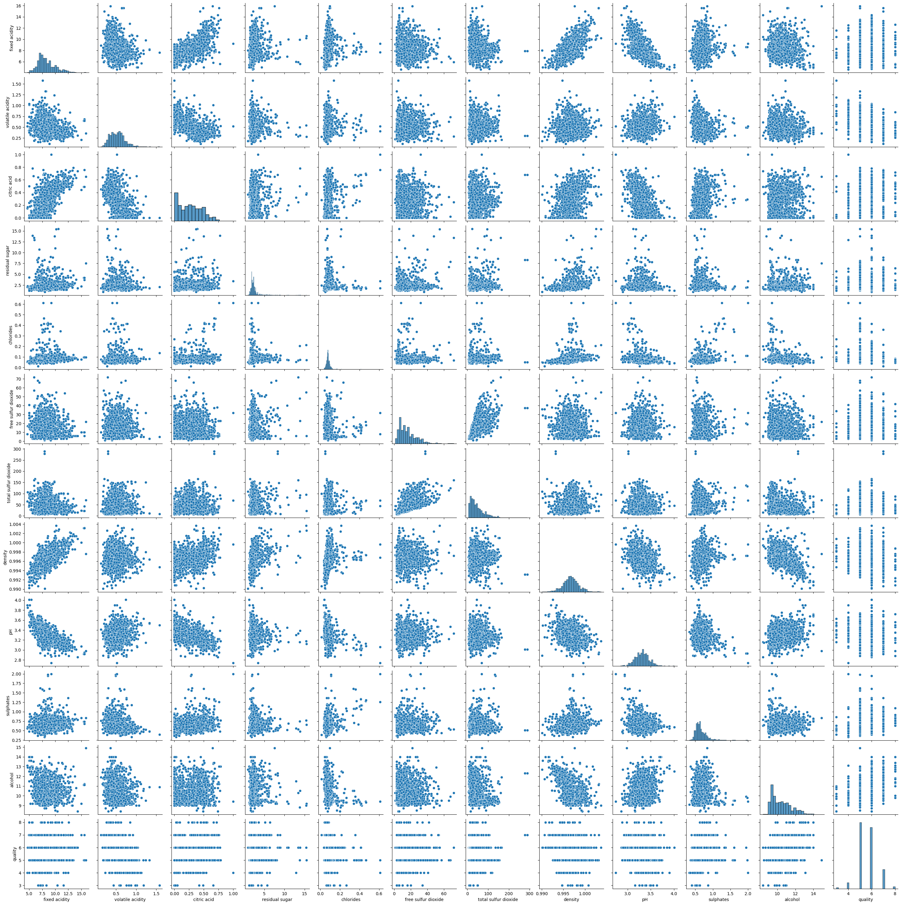
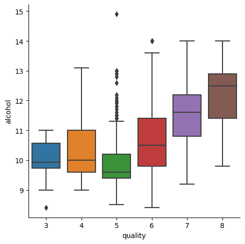
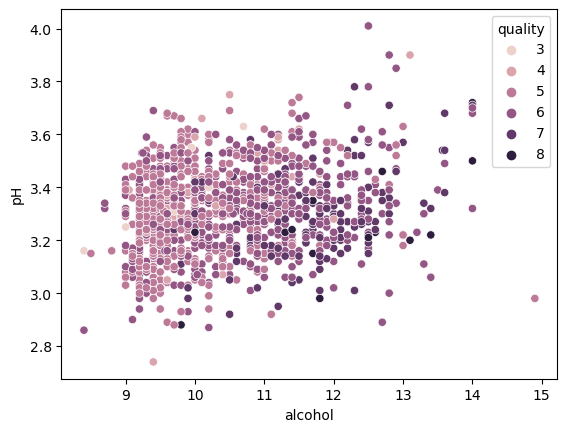

# Exploratory Data Analysis of Wine Quality Dataset

## Project Overview
This project focuses on performing Exploratory Data Analysis (EDA) on a wine quality dataset. The analysis aims to uncover insights about various physicochemical properties of wine and their relationship with wine quality.

## Dataset Features
The dataset includes the following attributes:
1. Fixed acidity
2. Volatile acidity
3. Citric acid
4. Residual sugar
5. Chlorides
6. Free sulfur dioxide
7. Total sulfur dioxide
8. Density
9. pH
10. Sulphates
11. Alcohol
12. Quality (score between 0 and 10)

## Libraries Used
- pandas
- seaborn
- matplotlib

## Main Analyses
1. Data Loading and Inspection
   - Loading the dataset from a CSV file
   - Displaying basic information about the dataset

2. Visualization Techniques
   - Pairplot for univariate, bivariate, and multivariate analysis
   - Box plot to visualize the relationship between quality and alcohol content
   - Scatter plot to explore the relationship between alcohol content, pH, and quality

## Key Visualizations

1. Pairplot: Overview of relationships between all variables
   

   
Preview

   
   
   

2. Box Plot: Alcohol content distribution for different quality ratings
   

   
Preview

   
   
   

3. Scatter Plot: Alcohol content vs pH, with quality as hue
   

   
Preview

   
   
   

## Insights
- The analysis reveals potential correlations between various wine attributes and quality
- Alcohol content seems to have a notable relationship with wine quality
- pH levels show some interesting patterns when plotted against alcohol content and quality

## Future Work
- Perform statistical tests to quantify relationships between variables
- Implement machine learning models to predict wine quality based on physicochemical properties
- Expand the analysis to include more advanced visualization techniques

## Data Source
The project uses the 'winequality-red.csv' dataset, which contains information about red wine samples.
